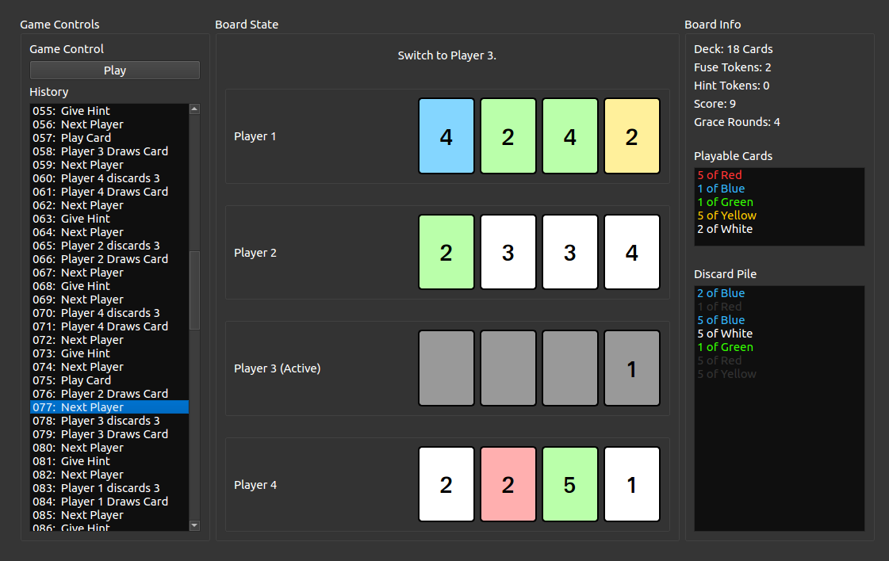
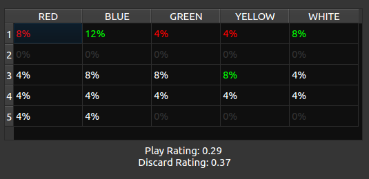

# Python Hanabi Simulator
This repository contains an implementation of Hanabi in Python. There is a visual GUI simulator, and a rules based AI agent to play copies of itself in the game.


## Quick Start

First, ensure that you are running Python 3.6 or above. If you do not have a virtual environment or Python 3.6 installed, I recommend to use the [Miniconda Python environment package](https://conda.io/miniconda.html).

Here is how to create a Python 3.6 environment named `hanabi` using conda:

```bash
conda create --name hanabi python=3.6
```

More details about Miniconda environments can be found [here](https://conda.io/docs/user-guide/tasks/manage-python.html).

Check that the version of Python activated is 3.6:

```bash
python --version            
# Should return Python 3.6.6 :: Anaconda, Inc.
```

This Hanabi Simulator depends on PyQT5. You can install it by navigating your terminal to the root of this repository, and install the requirements from the `requirements.txt` file.

```bash
pip install -r requirements.txt

# Or you could install pyqt5 directly as well...
pip install pyqt5
```

Great! Now with `pyqt5` installed as the lone dependency, we can run the simulator.

```bash
./cmd_hanabi_interface.py
```

Now you should see the interface window show up. You can press "Play" to simulate a game. The board is interactive, so you can scroll up and down the history list, or click a card to view its probability matrix as seen by the observing player.


#### Main Simulator Interface




#### Card Matrix View




## Package Contents

**py_hanabi**: This package contains all the game simulation logic, agent logic, and all the supporting data structures for both.

**py_hanabi/commands**: The Hanabi game is architectures with a CQRS design pattern. This means that all of the actions that can change the state of the game are implemented as a command (including drawing a card and switching player index). Each command must implement a `forward` and a `backward` function.

**py_hanabi/interface**: This package contains the GUI view for the simulator.

**java_agent**: This contains a Java implementation of the same agent.

