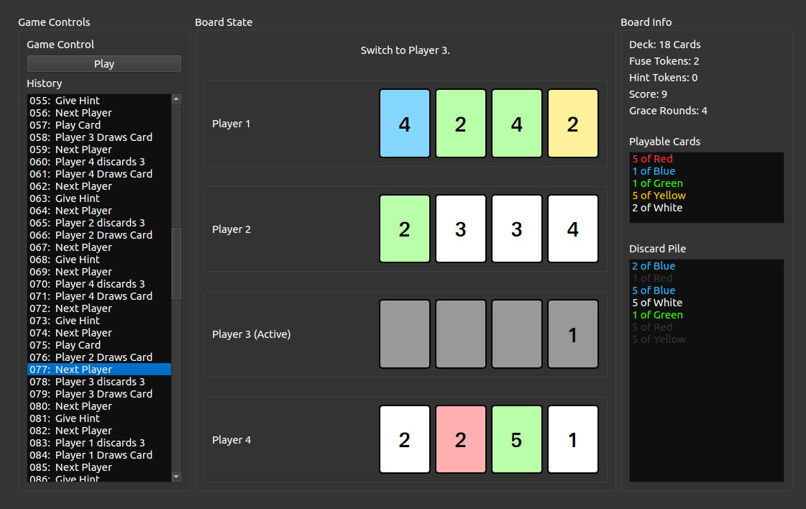
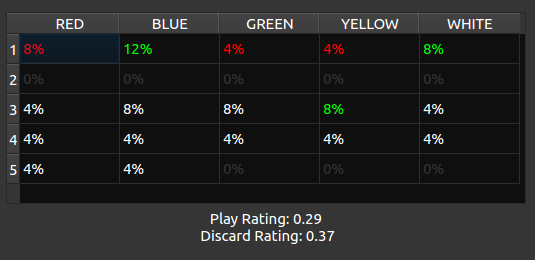

# Hanabi AI Agent

**CITS3001 Major Project Research Report** by Jakrin Juangbhanich
2998 Words


## Contents

1. [Introduction](#introduction)
2. [Literature Review](#literature-review)
3. [Selected Strategy](#selected-strategy)
4. [Implementation](#implementation)
5. [Validation](#validation)
6. [References](#references)


## Introduction

Hanabi is a co-operative card game for 2-5 players. There are 50 cards in the deck, with five suits (red, green, blue, white, yellow) and five values (from 1 to 5). The cards must be played in a certain sequence (ascending order by suit), and the goal of the game is to play as many cards as possible before it is over. The key mechanic of this game is that players cannot see their own hand, but can see the other players' hands. During their turn, they may chose to play a card, discard a card, or give another player some information. The official rules can be found here: [Hanabi Card Game Rules PDF](https://www.spillehulen.dk/media/102616/hanabi-card-game-rules.pdf). Also, a perfect solution to this game is [considered to be NP Complete](http://teaching.csse.uwa.edu.au/units/CITS3001/project/2018/papers/HanabiNP.pdf).

The goal of this project is to build an AI agent to play the game, Hanabi. Current published strategies for playing the game fall largely into either Monte Carlo Tree search or some form of rules based system. I believe that there is a lot of information to be modeled during the game, so my approach was to augment a simple rules based agent with high quality information about the board state. In addition to this, I focused on building fast simulation and visualization pipelines so that I can gain deeper insight into how to improve an agent.

I developed a Hanabi simulator and GUI in Python for rapid experimentation and testing, and finally ported the agent to Java once I was satisfied with the results. The agent computes a probability matrix for each card in hand, as well as a value matrix for each possible hint that it can give to other players. By using this information with a simple rules engine, this agent is able to achieve an average score of **17.03** when playing a 4-player game with itself (over a sample size of 500 games).


## Literature Review

#### Hirotaka Osawa Agent: 2015

Osawa's paper presents several different agents, each one adding some incremental improvement on the previous agent. The most advanced agent in this paper demonstrates some understanding of its internal state and external state. Also, upon receiving a hint, the agent will attempt to simulate the previous state as seen from the hint giver's perspective. This is an attempt to predict what the hint giver's intention where, and thus gain more implicit information about the board.

This agent was simulation in a 2-player game, with *n-games* = 100. The average score was **15.85** using this "self recognition strategy." This is an impressive result, as I found that my agent struggles a lot more when there are fewer players.

However, I do not believe this to be a good general strategy. A large part of this strategy aims to model the world state from the previous player's perspective. In a 2 player scenario, this is much easier to simulate because there is only one other player. Also, any hint received by the agent is guaranteed to come from the single other player. This strategy also assumes that the other player is using the exact same strategy to play; that is, it assumes that it is playing a mirror-image of itself.

Whilst this may be specialized to deal with a mirror-match in a 2-player scenario, I do not think it will be robust to 3, 4 or 5 player games, and with different agents. Although the self-recognition agent was not tested in *Walton-River et al's paper (2017*), Osawa's outer-state agent demonstrated significantly lower scores when evaluated in a larger team game.

#### Van den Bergh Agent: 2015

Van den Bergh's paper examines the playability and properties of Hanabi. It also presents a general strategy for a game playing agent. The strategies are built around the natural intuition from human play. Primarily, this is to:

1. Play a card if certain that is playable.
2. Discard a card if certain that it can be discarded.
3. If hint tokens remain, give the most useful hint to another player.
4. Otherwise, discard the card most likely to be unplayable.

Of course, there are many parameters and policies for each of these steps. The author also presents the case for special situations, such as when the game is ending and the agent is better off 'guessing' a card than giving a hint.

Different strategies were simulated in a 3-player mirror match, with *n-games*=10. The simulation also tests 10,000 different parameter configurations with each strategy. The strongest combination with the following rules:

* Discard Rule: discard the card that seems most useless.
* Hint Rule: Giving a hint on the next useful card in sight or on the largest number of card.

The score of this agent is **15.4**.

Van den Bergh also explores the idea of using Monte-Carlo Tree Search. But the results seem poor, with high simulation costs only achieving an average score of **14.5**. The author cites that MCTS can be awkward to apply to Hanabi because of the nature of hidden information in the game, and the limited fuses for each player to make a mistake.

#### Evaluating Hanabi Agents: 2017

Watlon-River's paper *Evaluating and Modeling Hanabi Playing Agents* discusses the above two agents, as well as some other ones (most notably the Predictor IS-MCTS model). The simulations included mirror-match benchmarks, as well as 2, 3, 4 and 5 player games using a different combination of agents. The authors also included intentionally flawed agents to evaluate how other agents would perform when playing with a non-optimal team-mate.

The authors point out that MCTS has the desirable property of being able to operate without domain specific knowledge. The best performing agent in this paper was the Predictor IS-MCTS model. However, the downside of this agent is that it must be provided with a model for each of the other agents that it is playing with. Also, it is quite slow - the authors had to limit its time per move to 1 second (whereas a rules based agent could complete an entire game in that same time).

What was most notable for me in this paper was the care that the authors had taken to create perfect simulation environments. All the non-determinism was seeded to ensure that each agent was evaluated under the same conditions. Large n-game sizes were used, and the tests covered many different possible combination of agent pairings.

Because the simulation method was different, I am unable to use the leading score (**12.14** in a 3-player game with the IS-MCTS agent) in any meaningful way (since I only have the capacity to test mirror match set ups).


## Selected Strategy

For my agent, I have used a rules-based strategy (Van den Bergh) as my starting point. I have chosen this because the performance metrics look good, and it does not make as many assumptions as the other agents I have looked at in order to play well.

I wanted to use as much common sense and intuition in developing this agent as I can, and I believe that the best place to start is to produce as much useful data as possible. No matter if the agent's main mechanism is hard coded rules, or a neural network, I think that the more data it has available, the better it will perform. My plan in this project was to implement a similar agent to Van den Bergh's, and augment it with a better model for understanding the board state. 

Here is an outline of my development strategy:

* **Implement a Hanabi CQRS and GUI for analysis**: In order to design and improve the strategy, the first step was to make powerful tools that allowed me to look at each game in great detail. Firstly I created a GUI for the game state, allowing me to interact with the cards and see their data visually. I used a CQRS (command queue) design pattern to simulate the game, meaning that I could click through a history of all the moves, to see the state before and after each move.
* **Apply Bayesian Reasoning**: For each card in hand, the agent computes a probability score (for each possible color and value combination), and a rating (for whether it should be played or discarded). It can also do this on behalf of other agents, to understand where a hint is best used. This will allow the agent to make better decisions.
* **Improved Hint Policy:** Probably the most crucial aspect of this agent is how it decides to give out hints. The agent will use the Bayesian reasoning above, but from other agent's point of view, to determine the hint with the best overall value for the game.
* **Analyze and Experiment**: Once I have a basic agent running with the above information, I can analyze the games played and develop some intuition about ways to improve the agent.

The agent itself is very simple. It has two main components:

#### Card Value Matrix

The agent's main function is to compute a probability matrix for an unknown card. The matrix must contain the following information for each possible **color** and **value** combination:

| Key              | Description                                                  |
| ---------------- | ------------------------------------------------------------ |
| `probability`    | The probability that this unknown card matches this **color** and **value**. |
| `play_rating`    | Either `1.0` or `0.0`, indicating if this card can be immediately played or not. |
| `discard_rating` | A number between `0.0` and `1.0`. The higher the number, the more desirable it is for this card to be discarded. |

The matrix will be 5 x 5. Finally, it can compute a heuristic value for how playable or how discardable an unknown card is, by summing the product of each element's probability with its ratings.

The matrix will be produced with the following procedure, for each unknown card *C* in the player's hand:

* First, a duplicate of the initial deck is used as the starting pool, *P*.
* All cards from the discard pile, fireworks pile, and observed in all other players' hands are removed from *P*.
* If this card (*C*) has received a hint, then remove all cards from *P* that do not share the same color/number as the hint received.
* If *C* was in the player's hand during a hint, but did not actually receive the hint, then remove that hint's color and number from *P*.
* Finally, iterate through each color-value combination (c, v). The probability of any particular color combination is **the count of (c, v) still in *P*, divided by the total number of cards still in *P*.**
* Now, for card *C* we have a probability matrix for each possible color-value combination.
* For each color-value combination, we can also calculate the play rating. If the card can immediately be played (according to the fireworks state), give it a score of `1.0`. If it cannot be played, the score is `0.0`.
* The total *play rating* of *C* is then the sum of **playRating(c, v) * probability(c, v)** for each (c, v) combination.

#### Gameplay Policy

The matrix above will help the agent work out the probability of a certain move being successful. I then pair this information with a simple rules based engine to play the game.

1. If there are more than 1 fuse tokens, play a card with rating >= ` K_NORMAL_PLAY_LIMIT`. Otherwise, play a card with rating >= `K_SAFE_PLAY_LIMIT`.
2. **(Bonus Step: Hint Boosting)** If no cards were played initially, then look at the cards again. Any cards that have received a hint will have their ratings boosted to a factor of `K_HINT_PLAY_BOOST`. We then see if any cards can be played with the ratings boost. This is done assume that other agents will favor hinting towards immediately playable cards. However, if the other agents are unknown, it may be best to disable this feature by setting the co-efficient to `1.0`.
3. If there is a card with a discard rating >= ` K_DISCARD_LIMIT` then discard the card.
4. If hint tokens remain, then give a hint to another player according to the agent's **hint policy**.
5. Otherwise, desperate times calls for desperate measures... discard the card with the highest discard rating.

The default parameters are:

```python
K_NORMAL_PLAY_LIMIT = 0.80
K_SAFE_PLAY_LIMIT = 1.00
K_DISCARD_LIMIT = 0.90
K_HINT_PLAY_BOOST = 1.25
```

#### Hint Policy

The agent will also compute a matrix, this time from its target's point of view, to decide how best to reward its next hint.

The hints will be played aggressively, prioritizing these factors:

* Whether or not this hint can immediately enable the target player to play a new card with 100% confidence.
* Whether or not this is a card that can be played (even if the hint doesn't give the player full information).
* Whether or not this will allow the player to discard this card with 100% confidence.
* Otherwise, maximize the `play_rating` gain from giving this hint to another player.
* All other things equal, players closer to the current player will be prioritized.


## Implementation

The Python simulator for Hanabi was implemented with PyQT5 as the sole dependency. It allows the user to scroll forwards and backwards through a game's actions and see the state at any given point. 



Clicking on a card will also allow the player to see the distribution matrix for that card (from the player's perspective). Green numbers indicate cards that can immediately be played. Red numbers indicate cards that can immediately be discarded.



To run this simulator, use a new Python 3.6 environment and install PyQT5.

```bash
pip install -r requirements.txt
python ./cmd_hanabi_interface.py
```

#### Commands

The simulator was implemented using a **Command Queue** design pattern. This means that the state is fluid, being updated on demand by a list of commands in sequence. Every action in the game must be extended from the Command superclass, and implements a `forward` and `backward` method. These methods must modify the game state respectively, and this is the mechanism that allows the user to both fast forward or rewinding a state.

For advanced simulations, we could theoretically load up a state up to a certain point, and 'replay' that move in many different ways in order to train or develop the agent.

#### Matrix Design

The matrix structure was implemented using a hash map data structure. The color and value of a card is combined to make a string key, and each element in table is a `CardStat`, which contains the probability and ratings of each card. The hash map is essential to the speed of this algorithm. This is because the agent must compute a new matrix for every permutation of other player's cards against every possible hint action (this is to determine the ideal hint to dispense). Calculating and caching some maps (cards that can be played, colors that are blocked from playing, cards that can be discarded) was crucial to enabling the agent to execute in real time on an Intel Core i7 3.0 Ghz processor.

#### Java Implementation

The entire Python agent was then ported into a single Java file. The different classes have been implemented as private classes in the package scope.


## Validation

This are tables of the agent's results using the default configuration. In each testing sample, the games are played 500 times. I tested the agent in mirror match situations (the agent plays copies of itself) and in situations where it plays with the `BasicAgent ` provided by the project to test its robustness.


##### Matrix Agent plays against copies of itself, without hint boosting.

| Number of Players | Score Average |
| ----------------- | ------------- |
| 2                 | 10.92         |
| 3                 | **17.12**     |
| 4                 | 16.94         |
| 5                 | 16.11         |


##### Matrix Agent plays against copies of itself, with hint boosting:

'Hint boosting' is where an agent will assign a greater 'play' rating to cards that have been received a hint, unless that card has a strong probability to be discarded. It assumes that other agents will prioritize giving hints to actually playable cards.

| Number of Players | Score Average |
| ----------------- | ------------- |
| 2                 | 12.60         |
| 3                 | **17.40**     |
| 4                 | 17.23         |
| 5                 | 16.32         |


##### Basic Agents plays against copies of itself:

| Number of Players | Score Average |
| ----------------- | ------------- |
| 2                 | **7.96**      |
| 3                 | 7.90          |
| 4                 | 7.39          |
| 5                 | 6.78          |


##### Solo Matrix Agent plays with Basic Agents, without hint boosting:

| Number of Players | Score Average |
| ----------------- | ------------- |
| 2                 | **11.71**     |
| 3                 | 11.62         |
| 4                 | 10.02         |
| 5                 | 8.90          |


##### Solo Matrix Agent plays with Basic Agents, with hint boosting:

In most cases, this agent actually performs worse. As expected, a tactic like 'hint boosting' only works if the agents can make assumptions about the other agents that it plays with.

| Number of Players | Score Average |
| ----------------- | ------------- |
| 2                 | 11.35         |
| 3                 | **11.75**     |
| 4                 | 9.97          |
| 5                 | 8.63          |


##Conclusion

This is an agent that plays well and can execute its moves quickly. The greatest strength of this agent is that it computes a lot of high quality data about the state of the game, which can be then used as further input either with a simple rules based engine (as above), or as part of a more complex model agent architecture (such as a neural network).

With an aggressive strategy and hint boosting, the agent is play quite well in mirror matches. With a more generic configuration, it can still reliably improve the average score in games with other basic agents.


## References

Osawa, H, 2015. Solving Hanabi: Estimating Hands by Opponent's Actions in Cooperative Game with Incomplete Information. *University of Tsukuba*.

Van Den Bergh, M, 2015. Aspects of the Cooperative Card Game Hanabi. *Leiden Institute of Advanced Computer Science*.

Walton-Rivers, J, 2017. Evaluating and Modelling Hanabi-Playing Agents. *School of Computer Science and Electronic Engineering, University of Essex*.
